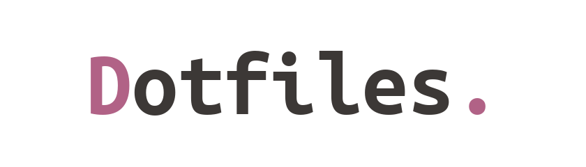
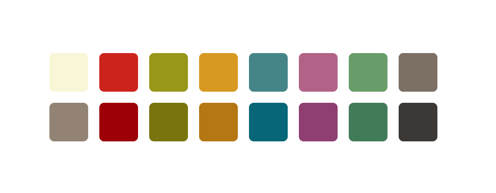

## My dotfiles

This is my personal configuration for a custom Desktop Environment, including useful scripts, a list of all the programs I use and installation instructions. This mainly works as a reference for myself but anyone else is also welcome to enjoy my configurations.

Here are the details of my setup:
- **Distro**: [Debian](https://www.debian.org/) - Debian Bullseye 11.
- **WM**: [qtile](http://www.qtile.org/), [dwm](https://dwm.suckless.org/), [BSPWM](https://github.com/baskerville/bspwm) - Mainly using qtile
- **DM**: [LightDM](https://github.com/canonical/lightdm) - Simple display manager with an easy configuration.
- **Shell**: [Bash](https://www.gnu.org/software/bash/) - Bash scripting is fun!
- **Terminal**: [st](https://st.suckless.org/), [Kitty](https://sw.kovidgoyal.net/kitty/) - Kitty is a feature rich terminal emulator that works well out of the box. St for slight performance boost.
- **Bar**: [Polybar](https://github.com/polybar/polybar) - Polybar for BSPWM. Qtile & dwm have a bar built in.
- **Compositor**: [Picom](https://wiki.archlinux.org/index.php/Picom) - Helps remove screen tearing.
- **Notifications**: [Dunst](https://wiki.archlinux.org/index.php/Dunst) - Simple notification manager.
- **Launcher**: [dmenu](https://tools.suckless.org/dmenu/), [Rofi](https://github.com/davatorium/rofi) - Used for a run prompt and passmenu
- **File Manager**: [PCManFM](https://wiki.archlinux.org/index.php/PCManFM) - Somewhat minimal graphical file manager.
- **Hotkeys**: [SXHKD](https://github.com/baskerville/sxhkd)
- **Text Editor**: [Vim](https://www.vim.org/), [Emacs](https://www.gnu.org/software/emacs/) - Programming and text editing.
- **Music Player**: [MPD](https://www.musicpd.org/), [NCMPCPP](https://github.com/ncmpcpp/ncmpcpp) - Polybar & qtile integration.

## Scripts
Most of my useful shell scripts are included in [.local/bin/](./.local/bin/).

Here are some example scripts:
- [rofi_dman.sh](./.local/bin/rofi_dman.sh) is a script to manage devices with rofi/dmenu. Features include mounting, unmounting, ejecting and listing devices.
- [toggle-theme.sh](./.local/bin/toggle-theme.sh) is a script to toggle between PaperColor Light & Dark theme. Supports Vim, Xresources, Kitty, BSPWM, dwm, dmenu, st, Polybar, Rofi, Dunst & GTK-2/3.
- [ff.sh](./.local/bin/ff.sh) is a script that uses FZF to find files by name, filetype and/or content.
- [bspwm_setup_monitors.sh](./.local/bin/bspwm_setup_monitors.sh) is a script that allows hotplugging external monitors for BSPWM and Polybar.

## Colors

<a href="https://github.com/gruvbox-community">Gruvbox Community Light</a>

## Installation
To install and integrate with your system you need to checkout the master branch and initialize included submodules.

    git --work-tree $HOME --git-dir $HOME/dotfiles init
    git --work-tree $HOME --git-dir $HOME/dotfiles remote add -t \* -f origin git@github.com:miikanissi/dotfiles.git
    git --work-tree $HOME --git-dir $HOME/dotfiles checkout master
    git --work-tree $HOME --git-dir $HOME/dotfiles submodule update --init
    git --work-tree $HOME --git-dir $HOME/dotfiles config --local status.showUntrackedFiles no

Alternatively you can clone the repository with submodules and move the files manually.

To install all of my Debian packages (this is a lot of packages) you can run:

    sudo apt install $(< ~/debian_programs.txt)

For JavaScript & Python development I have installed packages from npm and pip:

    pip3 install --upgrade pylint pylint_odoo
    npm install update -D prettier-eslint-cli

I use Ubuntu Mono Nerd Font as my main font. You can use my script to download and install it for your system:

    chmod +x ~/.local/bin/install_nerd_fonts_ubuntu_mono.sh
    ~/.local/bin/install_nerd_fonts_ubuntu_mono.sh

Elementary cursor theme requires moving icons to their correct location:

    cp -R ~/.icons/elementary-cursors/elementary/ ~/.icons/

Vimix icon theme needs to be installed with:

    cd ~/.icons/vimix-icon-theme/ && ./install.sh -a

Qtile installation for Debian:

    sudo apt install python3-cffi python3-xcffib
    pip3 install --upgrade cairocffi python-mpd2; pip3 install --upgrade qtile

Suckless program installation:

    sudo echo "[Desktop Entry]
    Encoding=UTF-8
    Name=dwm
    Comment=Dynamic window manager
    Exec=dwm
    Icon=dwm
    Type=XSession" > /usr/share/xsessions/dwm.desktop
    cd .local/src/suckless/dwm && sudo make clean install
    cd .local/src/suckless/dmenu && sudo make clean install
    cd .local/src/suckless/dwmblocks && sudo make clean install
    cd .local/src/suckless/st && sudo make clean install

To automatically run my keyboard setup script when keyboard is attached, we need to create a udev rule in `/etc/udev/rules.d/99-keyboard.rules`. You can find the vendor and model id for all usb devices by running the command `lsusb`:

    ACTION=="bind", SUBSYSTEM=="usb", ENV{ID_VENDOR_ID}=="04b4", ENV{ID_MODEL_ID}=="0510" RUN+="/bin/su m --command='/home/m/.local/bin/keyboard.sh'"

## Links / Credits
To stay up to date with me visit my [website](https://miikanissi.com).

Links:
- [Arch Wiki](https://wiki.archlinux.org/) - Arch Wiki is a great Linux resource for almost anything.
- [Uncle Dave](https://github.com/daedreth/UncleDavesEmacs) - He has a great youtube series on configuring Emacs from scratch.
- [Luke Smith](https://github.com/LukeSmithxyz) - He has nice dotfiles and good youtube tutorials on minimalist software.
- [Protesilaos Stavrou](https://gitlab.com/protesilaos/dotfiles) - He goes very in-depth on Emacs configuration on his youtube channel.
