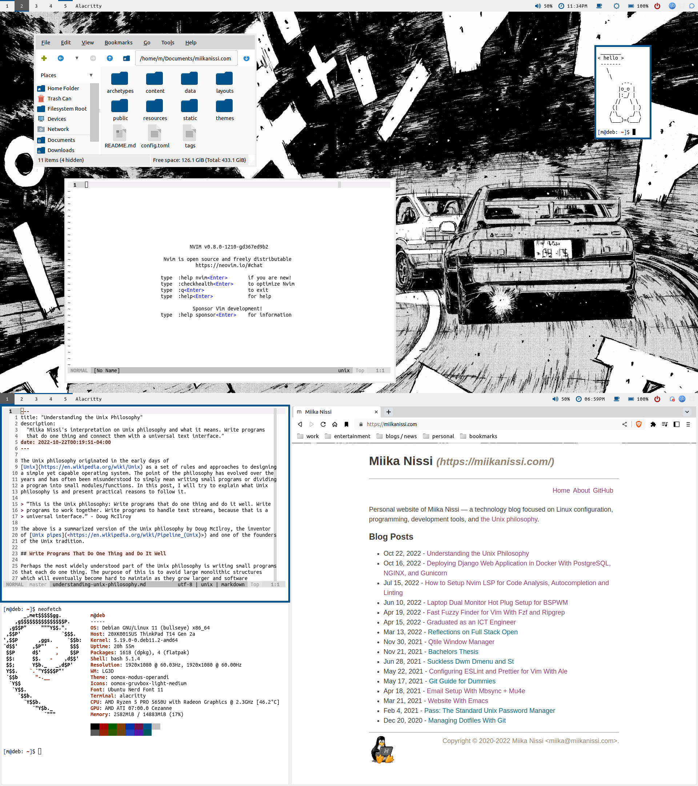

## My dotfiles

This is my personal configuration for a custom Debian Desktop Environment, including
useful scripts, a list of all the programs I use and installation instructions. This
mainly works as a reference for myself but anyone else is also welcome to enjoy and
extend upon my configurations.

Here are the details of my setup:

- **Distro**: [Debian](https://www.debian.org/) - Stable and reliable
- **WM**: [BSPWM](https://github.com/baskerville/bspwm) - A tiling window manager
- **DM**: [LightDM](https://github.com/canonical/lightdm) - A simple and beautiful
  display/login manager
- **Shell**: [Bash](https://www.gnu.org/software/bash/)
- **Terminal**: [Alacritty](https://github.com/alacritty/alacritty) - A fast terminal
  emulator
- **Bar**: [Polybar](https://github.com/polybar/polybar) - A fast and easy-to-use status
  bar
- **Compositor**: [Picom](https://wiki.archlinux.org/index.php/Picom) - Helps remove
  screen tearing
- **Notifications**: [Dunst](https://wiki.archlinux.org/index.php/Dunst) - A simple
  notification manager
- **Launcher**: [Rofi](https://github.com/davatorium/rofi) - An application launcher
  used for many of my scripts
- **File Manager**: [PCManFM](https://wiki.archlinux.org/index.php/PCManFM) - A basic
  graphical file manager
- **Hotkeys**: [SXHKD](https://github.com/baskerville/sxhkd)
- **Text Editor**: [Vim](https://www.vim.org/),
  [Emacs](https://www.gnu.org/software/emacs/) - Programming and text editing
- **Music Player**: [MPD](https://www.musicpd.org/),
  [NCMPCPP](https://github.com/ncmpcpp/ncmpcpp) - Polybar integration

## Scripts

Most of my useful shell scripts are included in [.local/bin/](./.local/bin/).

Here are some example scripts:

- [rofi_dman.sh](./.local/bin/rofi_dman.sh) is a script to manage devices with
  rofi/dmenu. Features include mounting, unmounting, ejecting and listing devices.
- [ff.sh](./.local/bin/ff.sh) is a script that uses FZF to find files by name, filetype
  and/or content.
- [bspwm_setup_monitors.sh](./.local/bin/bspwm_setup_monitors.sh) is a script that
  allows hotplugging external monitors for BSPWM and Polybar.
- [rofi_killprocess.sh](./.local/bin/killprocess.sh) is a script to kill running
  processes with rofi/dmenu.

## Colors

<a href="https://github.com/gruvbox-community">Gruvbox Community Light Medium</a>

## Installation

To install and integrate with your system you need to checkout the master branch and
initialize included submodules.

    git --work-tree $HOME --git-dir $HOME/dotfiles init
    git --work-tree $HOME --git-dir $HOME/dotfiles remote add -t \* -f origin git@github.com:miikanissi/dotfiles.git
    git --work-tree $HOME --git-dir $HOME/dotfiles checkout master
    git --work-tree $HOME --git-dir $HOME/dotfiles submodule update --init
    git --work-tree $HOME --git-dir $HOME/dotfiles config --local status.showUntrackedFiles no

Alternatively you can clone the repository with submodules and move the files manually.

To install all of my packages you can run my installation script:

    ./.local/bin/install_programs.sh

I use Ubuntu Mono Nerd Font as my main font. You can use my script to download and
install it for your system:

    chmod +x ~/.local/bin/install_nerd_fonts_ubuntu_mono.sh
    ~/.local/bin/install_nerd_fonts_ubuntu_mono.sh

Elementary cursor theme requires moving icons to their correct location:

    cp -R ~/.icons/elementary-cursors/elementary/ ~/.icons/

Suckless program installation:

    sudo echo "[Desktop Entry]
    Encoding=UTF-8
    Name=dwm
    Comment=Dynamic window manager
    Exec=dwm
    Icon=dwm
    Type=XSession" > /usr/share/xsessions/dwm.desktop
    cd .local/src/suckless/dwm && sudo make clean install
    cd .local/src/suckless/dmenu && sudo make clean install
    cd .local/src/suckless/dwmblocks && sudo make clean install
    cd .local/src/suckless/st && sudo make clean install

To automatically run my keyboard setup script when keyboard is attached, we need to
create a udev rule in `/etc/udev/rules.d/99-keyboard.rules`. You can find the vendor and
model id for all usb devices by running the command `lsusb`:

    ACTION=="bind", SUBSYSTEM=="usb", ENV{ID_VENDOR_ID}=="04b4", ENV{ID_MODEL_ID}=="0510" RUN+="/bin/su m --command='/home/m/.local/bin/keyboard.sh'"

## Links / Credits

To stay up to date with me visit my [website](https://miikanissi.com).

Links:

- [Arch Wiki](https://wiki.archlinux.org/) - Arch Wiki is a great Linux resource for
  almost anything.
- [Uncle Dave](https://github.com/daedreth/UncleDavesEmacs) - He has a great youtube
  series on configuring Emacs from scratch.
- [Luke Smith](https://github.com/LukeSmithxyz) - He has nice dotfiles and good youtube
  tutorials on minimalist software.
- [Protesilaos Stavrou](https://gitlab.com/protesilaos/dotfiles) - He goes very in-depth
  on Emacs configuration on his youtube channel.
- [kickstart.nvim](https://github.com/nvim-lua/kickstart.nvim) - A great starting point
  for a neovim "IDE" configuration
